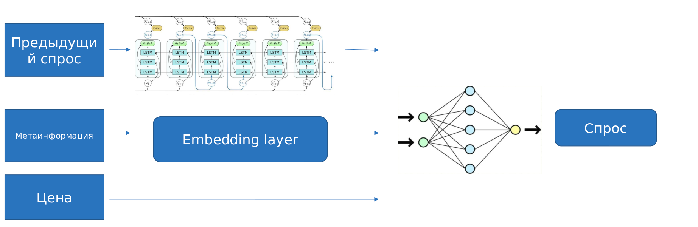
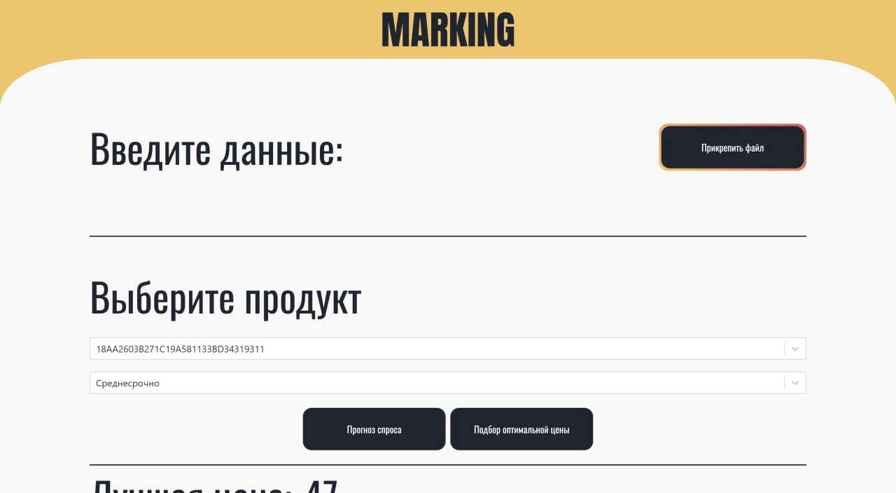
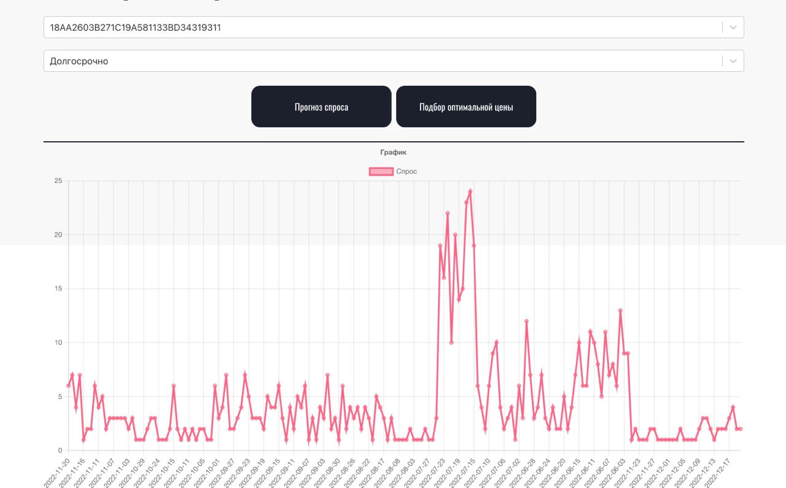
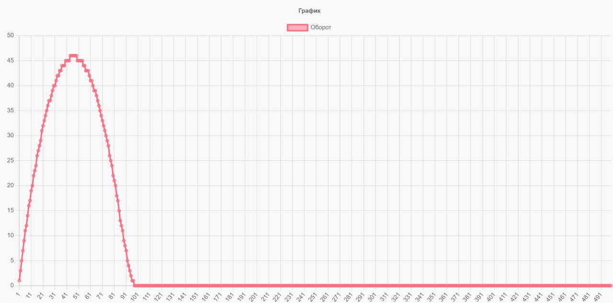
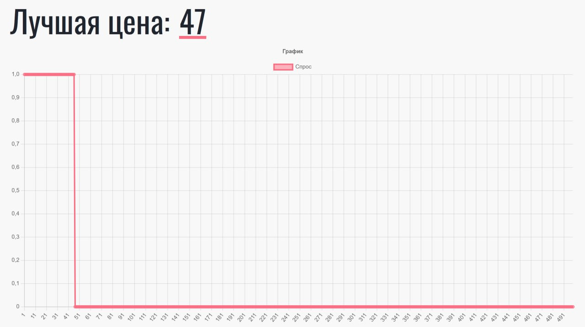

# Product management system

Система управления товарами для розничных продавцов на основе данных "Честного знака"

Use cases:
* Прогноз спроса для товара
  * Краткосрочный (1 день вперед, обучался на чанках спроса по неделе)
  * Среднесрочный (7 дней вперед, обучался на чанках спроса по 30 дней)
  * Долгосрочный  (50 дней вперед, обучался на чанках спроса по пол года)
* Расчет оптимальной цены для товара исходя их максимизации оборота

### Архитектура модели:

### Интерфейс продукта:

